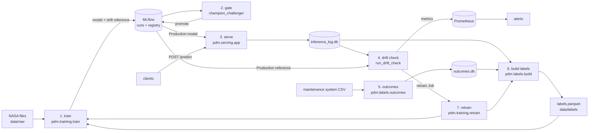

# How the code runs

**Project:** predictive-maintenance MLOps on NASA C-MAPSS. It predicts each engine's
remaining useful life (RUL, the cycles left before failure), detects input drift and
broken sensors, and safely retrains from real maintenance outcomes.

This file explains how to trace any run from start to finish without reading every
file. Why things are built this way is in [`decisions.md`](decisions.md) (IDs like D-4);
measured results are in [`run_log.md`](run_log.md). Every path and function name here
must match the code; update this file in the same change as the code.

**Terms used below**
- **Engine / asset:** one turbofan. `asset_id` is its ID in requests; `unit_number` is
  its ID in NASA files.
- **Cycle:** one flight/operating cycle; the time unit.
- **RUL:** remaining useful life, in cycles. Capped at 125 in training ("capped").
- **Feature:** a model input. Here: 3 operating settings + 14 sensors' 20-cycle rolling
  means (`sensor_X_roll_mean_20`).
- **Drift:** live inputs no longer look like the training data.
- **Champion / challenger:** the model in Production / a new candidate.
- **MLflow:** the experiment tracker and model registry (stores models, metrics, stages).
- **Artifact:** a file stored with an MLflow run (the model, the drift reference).

---

## 1. Entry points

All commands run from the repository root. Python ones need
`pip install -r requirements-dev.txt && pip install -e .`. On Windows,
`./Makefile.ps1 <task>` wraps the common ones (venv, install, lint, format, test,
download-data, train, seed-reference, serve, drift-check, build-*, kind-up/down,
rollback).

### Services and scheduled jobs

| Entry point | Command | What it does |
|---|---|---|
| Serving API | `OMP_NUM_THREADS=1 uvicorn pdm.serving.app:app --port 8000` | `POST /predict`, `GET /healthz`, `/readyz`, `/metrics`. Loads the Production model from MLflow and re-checks every 300 s. |
| Retrain job (weekly + drift-triggered) | `python -m pdm.training.retrain --raw-dir /data/raw` | Rebuilds outcome labels, trains a candidate, runs the champion/challenger gate, promotes if approved. K8s: `deploy/k8s/retrain-cronjob.yaml`. |
| Drift check (every 30 min) | `python -m pdm.drift.run_drift_check [--dry-run]` | Reads the last 24 h of predictions, runs the drift and sensor checks, pushes metrics, may start a retrain Job. K8s: `deploy/k8s/drift-check-cronjob.yaml`. |

### Command-line tools (`src/pdm`)

| Command | What it does |
|---|---|
| `python -m pdm.training.train [--raw-dir] [--config-name] [--no-register] [--fail-on-gate] [--tag K=V] [--json-out]` | Trains and logs one model (no gate). |
| `python -m pdm.evaluation.champion_challenger --candidate-version N [--promote] [--confirm-bootstrap] [--json-out]` | Scores candidate vs Production on the frozen data; promotes if approved and `--promote`. |
| `python -m pdm.labels.outcomes import --csv FILE` / `add --asset-id A --event failure\|maintenance --cycle N` / `list` | Records what happened to engines. |
| `python -m pdm.labels.build [--out DIR]` | Builds the label dataset from outcomes + inference log (preview; retrain does this itself). |
| `python -m pdm.data.download --subsets FD001` | Checks the NASA files are in `data/raw/` (does not download). |

### Scripts (`scripts/`)

| Script | What it does |
|---|---|
| `benchmark_real_data.py --raw-dir data/raw` | Model accuracy on NASA test sets (4 subsets × 5 seeds) + drift-check trigger rates → `reports/benchmark_cmapss.json`. ~5 min. |
| `calibrate_drift.py` | Picks the drift and sensor thresholds on 60 FD001 engines, measures on 40 → `reports/drift_calibration.json`. ~20 min. |
| `label_loop_demo.py --json-out reports/label_loop_fd003.json` | Replays FD003 through the API, records outcomes, retrains, scores before/after. ~20 min. Needs a Production model and scratch `INFERENCE_LOG_DB`/`OUTCOME_DB`/`LABELS_DIR`. |
| `build_cmapss_holdout.py` | One-time: picks the frozen holdout engines (already done: `data/holdout/cmapss_FD001_holdout_v1.json`). |
| `seed_reference_data.py` | Writes a drift reference to `data/processed/reference.parquet` (only for `reference.source: file`). |
| `generate_call_graph.py` | Regenerates `docs/call_graph/` (section 5). |
| `experiments/compare_drift_methods.py` | The experiment behind D-4/D-5. ~25 min. |
| `experiments/model_quality.py [--variants ...] [--out ...]` | Model variants × 5 seeds, scored like the gate → `reports/model_quality*.json` (D-26–D-28). ~15–25 min. |
| `promote_to_production.py`, `score_on_holdout.py`, `build_holdout.py`, `promote_model.py`, `rollback_production.py`, `mlflow_gcs_sync.py`, `rollback.ps1`, `setup_kind.ps1` | The IMS-bearing promotion flow, rollback, MLflow sync and cluster setup that predate this work; see `RUNBOOK.md`. `rollback_production.py` also works for `cmapss_rul`. |

### Tests

| Command | What it covers |
|---|---|
| `python -m pytest -q` | Everything (~2–3 min). |
| `python -m pytest tests/unit -q` | Fast, isolated tests. |
| `python -m pytest tests/integration/test_end_to_end_loop.py` | The whole loop on a synthetic fleet (~1 min): train → gate → serve → drift → outcomes → labels → retrain → rollback. |

### CI/CD (`.github/workflows/`)

`pr-checks.yaml` (on pull request), `build-and-push-dev.yaml` (push to main),
`promote-dev-to-staging.yaml`, `promote-staging-to-prod.yaml`, `rollback.yaml` (manual).
These drive the IMS-bearing model and image promotion; they predate this work.

---

## 2. Folder layout

```
.
├── config/                     YAML settings read by load_yaml() (section 9)
├── data/
│   ├── raw/                    NASA files (git-ignored; see data/README.md)
│   ├── holdout/                frozen holdout sets (committed, never edited)
│   ├── processed/              optional file-based drift reference
│   ├── outcomes/               outcome store SQLite (git-ignored, runtime)
│   └── labels/                 built label datasets (git-ignored, runtime)
├── deploy/
│   ├── k8s/                    CronJobs (retrain, drift), MLflow, PVCs, RBAC
│   ├── helm/pdm-serving/       serving chart: Argo canary Rollout, shadow, Ingress
│   ├── grafana/                dashboard + provisioning
│   └── kind/                   local cluster config
├── docker/                     serve / train / drift images
├── docs/
│   ├── decisions.md            why (decision log)
│   ├── execution.md            how it runs (this file)
│   ├── run_log.md              what was run and measured
│   └── call_graph/             AUTO-GENERATED call graphs (.dot/.svg/.txt)
├── monitoring/prometheus/      alert and recording rules
├── reports/                    JSON results of benchmarks/calibrations/demos
├── scripts/                    one-off and operational scripts (section 1)
├── src/pdm/
│   ├── common/                 config loading (config.py), logging
│   ├── data/                   NASA loaders (cmapss.py), features (features.py),
│   │                           dataset adapters + holdout (datasets.py), IMS bearing
│   ├── training/               train.py (fit + log), rul_model.py (model bundle),
│   │                           retrain.py (labels + train + gate), evaluate.py (RMSE)
│   ├── evaluation/             champion_challenger.py (gate), decision.py (maintenance
│   │                           cost), registry.py (MLflow stages/rollback), bearing gate
│   ├── labels/                 outcomes.py (outcome store), build.py (labels)
│   ├── drift/                  run_drift_check.py (job), life_stage.py, sensor_check.py,
│   │                           reference.py, trigger_retrain.py (K8s Job)
│   └── serving/                app.py (FastAPI), inference.py, inference_log.py,
│                               model_loader.py, schemas.py, metrics.py
├── tests/
│   ├── unit/, integration/     pytest suites
│   ├── synthetic_cmapss.py     synthetic fleets for the end-to-end test
│   └── fixtures/               tiny committed data samples
├── README.md                   overview + measured results
└── RUNBOOK.md                  operations: alerts, outcomes, rollback
```

---

## 3. End-to-end flow



| # | Step | Input | Output | Stored in | Module |
|---|---|---|---|---|---|
| 1 | Train | `data/raw/train_FD001.txt` (minus holdout engines) + `data/labels/labels.parquet` | model bundle, drift reference, metrics, data manifest | MLflow run artifacts + registry version | `pdm.training.train` |
| 2 | Gate | candidate version, Production version, frozen holdout engines + NASA test set | approve/reject + reasons; promotion | MLflow registry stage + `gate_*` tags | `pdm.evaluation.champion_challenger` |
| 3 | Serve | `POST /predict` JSON (features, asset_id, cycle) | RUL, interval, maintenance flag | row in `inference_log` table | `pdm.serving.app` |
| 4 | Drift check | last 24 h of log rows, Production drift reference | action (none / retrain / hold / skip), metrics | Pushgateway → Prometheus; K8s Job | `pdm.drift.run_drift_check` |
| 5 | Record outcomes | CMMS CSV (`asset_id,event_type,cycle`) | outcome events | `outcome_events` table | `pdm.labels.outcomes` |
| 6 | Build labels | outcome events + that engine's log rows | `labels.parquet` + `manifest.json` | `LABELS_DIR` | `pdm.labels.build` |
| 7 | Retrain | steps 6 → 1 → 2 in one process | new candidate, maybe promoted | as above | `pdm.training.retrain` |

---

## 4. Single-run walkthrough: `python -m pdm.training.retrain --raw-dir data/raw`

This is the main entry point: it exercises labels, training and the gate.

1. `pdm.training.retrain.main()` sets up logging (`setup_logging`) and the MLflow URI
   (`configure_mlflow_env` — refuses an empty `MLFLOW_TRACKING_URI`), parses flags, and
   loads `config/training.yaml` with `load_yaml`.
2. `retrain(raw_dir, config, promote=True)`:
   1. `refresh_labels(config)` → if `labels.enabled`: `build_and_write(...)`
      - `OutcomeStore(OUTCOME_DB).events()` → list of event dicts.
      - `InferenceLog(INFERENCE_LOG_DB).read_for_assets(ids)` → non-shadow log rows for
        engines that have events.
      - `build_labels(rows, events, feature_cols, rul_cap)` → `(DataFrame, stats)`:
        one row per labelled reading (exact label from failures; label 125 for readings
        ≥125 cycles before a maintenance; everything else dropped and counted).
      - `write_label_dataset(...)` → writes `labels.parquet` + `manifest.json`, returns
        the manifest.
   2. `run_training(raw_dir, config, register=True)`:
      - `get_adapter("cmapss")["load"]` = `_cmapss_load` → `_cmapss_features` (reads
        `train_FD001.txt` via `load_train`, sorts, caps RUL, `build_feature_matrix`,
        keeps uncapped `true_rul`) then drops the holdout engines
        (`load_holdout_units`). Returns `(feature_df, feature_columns)`.
      - `add_outcome_labels(feature_df, cols, config)` → appends `labels.parquet` rows
        (`load_label_dataset`), returns `(rows, manifest)`.
      - `base_data_manifest(...)` → raw-file sha256, holdout file, row counts.
      - `_run_bundle_training(...)`:
        - `fit_bundle(feature_df, cols, config, _cmapss_split)` → with
          `calibration: cross_validation` (the default) calls `_fit_bundle_cv`: splits
          engines into 5 folds, predicts each fold with models fitted on the others
          (point + two scikit-learn quantile models), sets the conformal correction
          from all out-of-fold predictions, fits the final models on all engines
          (`RULIntervalModel.fit`), stores feature ranges (`_set_feature_ranges`) and
          picks the threshold on out-of-fold lower bounds
          (`_choose_maintenance_threshold` → `choose_threshold` → `simulate_policy`).
          With `calibration: split` it uses one 80/20 engine split instead. Returns
          `{"bundle", "train_df", "val_df", "metrics"}`.
        - Logs params/metrics/`data_manifest.json`, logs the model with
          `mlflow.pyfunc.log_model(python_model=RULPyfunc(bundle))` and registers a
          version.
        - `add_oof_predictions(feature_df, cols, model_cfg)` → drift reference with
          out-of-fold `predicted_rul`, logged as `drift_reference/reference.parquet`.
        - Returns `{"run_id", "model_version", <metrics>, "gate_passed"}`.
   3. `run_gate(model_version, raw_dir, config, promote=True)`:
      - `load_evaluation_data(...)` → frozen holdout engines (`load_cmapss_holdout`) +
        last cycle of each NASA test engine (`load_test`, `build_feature_matrix`).
      - `score_model(candidate, ...)` and, if a different Production version exists,
        `score_model(champion, ...)` → test RMSE, interval coverage/width, holdout
        cost per engine, unplanned failures (`simulate_policy`).
      - `decide(challenger, champion, gate_cfg, coverage_target, bootstrap)` →
        `GateDecision(approved, reasons)`.
      - If approved: `promote_version_with_metrics(...)` → moves the rollback marker,
        sets stage Production, writes `gate_*` tags.
      - Returns the report dict (approved, promoted, reasons, both score sets).
3. `main()` logs "promoted" / "NOT promoted", writes `--json-out`, exits 0. A gate
   rejection is a normal outcome (exit 0); an exception in training exits non-zero.

---

## 5. Function call graph

### Auto-generated — do not edit by hand

Regenerate after any structural change: `python scripts/generate_call_graph.py`
(needs `pyan3` and Graphviz `dot`). Static analysis: calls made through variables (e.g.
`adapter["load"](...)`) and into libraries are not shown.

| Graph | Image | Source | Edge list |
|---|---|---|---|
| Whole package | [full.svg](call_graph/full.svg) | [full.dot](call_graph/full.dot) | [full.txt](call_graph/full.txt) |
| Retrain job (`retrain`) | [retrain.svg](call_graph/retrain.svg) | [retrain.dot](call_graph/retrain.dot) | [retrain.txt](call_graph/retrain.txt) |
| Drift job (`run_drift_check.main`) | [drift.svg](call_graph/drift.svg) | [drift.dot](call_graph/drift.dot) | [drift.txt](call_graph/drift.txt) |
| `POST /predict` (`app.predict`) | [serving.svg](call_graph/serving.svg) | [serving.dot](call_graph/serving.dot) | [serving.txt](call_graph/serving.txt) |

### Hand-written main call chains

```
pdm.training.retrain.main()
 ├─ load_yaml("training.yaml")
 └─ retrain()
     ├─ refresh_labels()
     │   └─ build_and_write()
     │       ├─ OutcomeStore.events()
     │       ├─ InferenceLog.read_for_assets()
     │       ├─ build_labels()
     │       └─ write_label_dataset()
     ├─ run_training()
     │   ├─ _cmapss_load() ── _cmapss_features() ── load_train(), build_feature_matrix()
     │   ├─ add_outcome_labels() ── load_label_dataset()
     │   ├─ base_data_manifest()
     │   └─ _run_bundle_training()
     │       ├─ fit_bundle()
     │       │   └─ _fit_bundle_cv()               (calibration: cross_validation)
     │       │       ├─ RULIntervalModel.fit() ×6 ── _fit_point(), _make_regressor()
     │       │       ├─ _set_feature_ranges()
     │       │       └─ _choose_maintenance_threshold() ── choose_threshold() ── simulate_policy()
     │       ├─ mlflow.pyfunc.log_model(RULPyfunc)
     │       └─ add_oof_predictions() ── _fit_model()
     └─ run_gate()
         ├─ load_evaluation_data() ── load_cmapss_holdout(), load_test()
         ├─ score_model() ×2 ── simulate_policy()
         ├─ decide()
         └─ promote_version_with_metrics() ── _move_rollback_tag()

pdm.drift.run_drift_check.main()
 ├─ load_reference() ── get_production_version(), MlflowClient.download_artifacts()
 ├─ read_window() ── InferenceLog.read_since() | read_recent()
 ├─ run_check()
 │   ├─ count_engines()
 │   ├─ decide_action()              (skip if < min_engines)
 │   ├─ evaluate_window()
 │   │   ├─ match_life_stage()
 │   │   ├─ compute_drift_score()    (Evidently DataDriftPreset)
 │   │   └─ diagnose() ── sensor_fault_scores() ── fit_residual_models(), residuals()
 │   └─ decide_action()
 ├─ push_metrics()                   (Pushgateway)
 └─ trigger_retrain_if_needed() ── trigger_retrain_job()   (only if action == "retrain")

pdm.serving.app.predict()            (POST /predict)
 ├─ _get_loaded_model()
 ├─ validate_features(), non_finite_features(), out_of_range_features()
 ├─ predict_details() ── model.predict() → RULPyfunc.predict() → RULIntervalModel.predict_frame()
 ├─ InferenceLog.record()
 └─ metrics: REQUEST_COUNT, REQUEST_LATENCY, PREDICTION_VALUE, INPUT_*, feature_stats.update()

pdm.serving.app.lifespan()           (startup)
 └─ ModelLoader.start() ── load_once() ── get_latest_versions(), mlflow.pyfunc.load_model(), _feature_ranges()
                        └─ _refresh_loop() (thread, every refresh_seconds)
```

---

## 6. Key functions reference

| Function | File | What it does | Inputs → outputs | Side effects | Called by |
|---|---|---|---|---|---|
| `run_training` | `src/pdm/training/train.py` | Loads data, adds labels, fits, logs, registers | raw_dir, config → result dict | MLflow run, model version, artifacts | `retrain`, `train.main`, tests |
| `fit_bundle` | `src/pdm/training/train.py` | Fit bundle, calibrate interval, choose threshold (dispatches to `_fit_bundle_cv` or the split path) | feature_df, cols, config, split_fn → dict(bundle, train_df, val_df, metrics) | none | `_run_bundle_training`, experiments, tests |
| `_fit_bundle_cv` | `src/pdm/training/train.py` | 5-fold out-of-fold calibration, final models on all engines (D-26) | feature_df, cols, config → same dict | none | `fit_bundle` |
| `RULIntervalModel.fit` / `.predict_frame` | `src/pdm/training/rul_model.py` | Point + quantile models + conformal correction; returns rul, rul_lower, rul_upper, maintenance_recommended | X/y → model; X → DataFrame | none | `fit_bundle`, `RULPyfunc.predict` |
| `retrain` | `src/pdm/training/retrain.py` | Labels → train → gate | raw_dir, config → dict(labels, training, gate) | writes labels, MLflow, may promote | `retrain.main`, `label_loop_demo.py`, tests |
| `run_gate` | `src/pdm/evaluation/champion_challenger.py` | Scores candidate and champion, decides, promotes | version, raw_dir, config → report dict | may change Production stage | `retrain`, `champion_challenger.main` |
| `decide` | same | The gate rules | challenger, champion, cfg → `GateDecision` | none | `run_gate` |
| `simulate_policy` | `src/pdm/evaluation/decision.py` | Replays engines under "maintain when signal ≤ H" | trajectories, signal, H, lead time, costs → counts + cost | none | `choose_threshold`, `score_model` |
| `promote_version_with_metrics` / `rollback_to_previous` | `src/pdm/evaluation/registry.py` | Stage transitions + rollback marker | client, name, version → none / ModelVersion | MLflow registry | `run_gate` / `rollback_production.py` |
| `build_labels` | `src/pdm/labels/build.py` | Outcome events + log rows → labelled rows | rows, events, cols, cap → (DataFrame, stats) | none | `build_and_write` |
| `OutcomeStore.import_csv` | `src/pdm/labels/outcomes.py` | Imports a CMMS export, skips duplicates/bad rows | path → counts | writes `outcome_events` | CLI, demo |
| `run_check` | `src/pdm/drift/run_drift_check.py` | One drift check on read rows | reference, rows, config → dict(action, n_engines, evaluation) | none | `main`, demo, tests |
| `evaluate_window` | same | Life-stage matching + Evidently drift + sensor diagnosis | reference, window, cols, config → dict | none | `run_check`, benchmarks |
| `decide_action` | same | none / retrain / hold / skip | n_engines, drift share, culprits, config → str | none | `run_check` |
| `match_life_stage` | `src/pdm/drift/life_stage.py` | Resamples reference to the window's predicted-RUL mix | reference, predictions → (reference, coverage) | none | `evaluate_window` |
| `diagnose` | `src/pdm/drift/sensor_check.py` | Sensor fault vs system-wide shift | reference, window, cols, threshold → verdict, culprits, scores | none | `evaluate_window` |
| `load_reference` | `src/pdm/drift/reference.py` | Production model's drift reference (or file) | reference cfg → (DataFrame, source) | downloads from MLflow | drift `main`, demo, tests |
| `predict` | `src/pdm/serving/app.py` | Validates, predicts, logs one request | `PredictRequest` → `PredictResponse` | inference log row, metrics | HTTP |
| `InferenceLog.record` | `src/pdm/serving/inference_log.py` | Appends a log row (migrates old DBs on open) | features, prediction, ids → none | SQLite write | `predict` |
| `ModelLoader.load_once` | `src/pdm/serving/model_loader.py` | Loads Production model + feature ranges | → `LoadedModel` | MLflow read | `start`, refresh thread |

---

## 7. Data flow

| Data | Location | Format | Schema / contents | Written by | Read by |
|---|---|---|---|---|---|
| NASA training data | `data/raw/train_FD00x.txt` | whitespace text, no header | unit, cycle, 3 settings, 21 sensors | you (download) | `load_train` |
| NASA test data + truth | `data/raw/test_FD00x.txt`, `RUL_FD00x.txt` | same / one number per engine | truncated histories / cycles left | you | `load_test` |
| Frozen holdout | `data/holdout/cmapss_FD001_holdout_v1.json` | JSON | `{"units": [...], "seed", ...}` | `build_cmapss_holdout.py` (once) | `load_holdout_units` |
| Model bundle | MLflow run `model/` | MLflow pyfunc (cloudpickle) | `RULPyfunc(RULIntervalModel)`; output columns rul, rul_lower, rul_upper, maintenance_recommended | `_run_bundle_training` | serving, gate |
| Drift reference | MLflow run `drift_reference/reference.parquet` | Parquet | unit_number, time_in_cycles, 17 feature cols, rul, true_rul, predicted_rul | `_run_bundle_training` | `load_reference` |
| Data manifest | MLflow run `data_manifest.json` | JSON | raw sha256, holdout file, label rows/sha/stats | `_run_bundle_training` | people (reproducibility) |
| Metrics / params / stages | MLflow tracking DB | SQLite (`MLFLOW_TRACKING_URI`) or server | val_rmse, maintenance_threshold, gate_* tags, stage | training, gate | gate, serving, drift |
| Inference log | `INFERENCE_LOG_DB` (default `./inference_log.db`) | SQLite table `inference_log` | id, ts, features (JSON), prediction, shadow, asset_id, cycle, observed_at, input_warnings (JSON), model_version | `InferenceLog.record` | drift job, `build_labels` |
| Outcome store | `OUTCOME_DB` (default `./data/outcomes/outcomes.db`) | SQLite table `outcome_events` | asset_id, event_type (failure/maintenance), cycle, event_ts, recorded_at, source, note; unique (asset, type, cycle) | `OutcomeStore` | `build_and_write` |
| Label dataset | `LABELS_DIR/labels.parquet` + `manifest.json` | Parquet + JSON | 17 feature cols, asset_id, life_end_cycle, time_in_cycles, rul, true_rul, label_kind, unit_number (≥1,000,000) | `write_label_dataset` | `add_outcome_labels` |
| Drift/sensor metrics | Prometheus Pushgateway | Prometheus text | pdm_drift_score, pdm_sensor_fault(_score){sensor}, pdm_drift_check_action{action}, pdm_drift_window_engines | `push_metrics` | alerts, Grafana |
| Serving metrics | `GET /metrics` | Prometheus text | pdm_predictions_total, pdm_request_latency_seconds, pdm_input_rejected_total{reason}, pdm_input_out_of_range_total{feature}, … | `app.predict` | Prometheus |
| Reports | `reports/*.json` | JSON | benchmark, calibration, method comparison, FD003 loop | scripts | people, docs |

---

## 8. Failure paths

| Failure | How it is detected | What the code does | How to recover manually |
|---|---|---|---|
| `MLFLOW_TRACKING_URI` set but empty | `configure_mlflow_env` | Raises, stops | Set the variable (usually a missing CI secret) |
| No Production model at serving startup | `ModelLoader.start` catches the error | Serves `/healthz`, `/readyz`=false, `/predict`=503; retries every refresh | Promote a version; `NoModelLoaded` alert |
| Model refresh fails later | `_refresh_loop` catches | Keeps the previous model | Check MLflow reachability |
| Request missing features / asset_id / has NaN | `validate_features`, `require_asset_id`, `non_finite_features` | 422, counted in `pdm_input_rejected_total{reason}` | Fix the client |
| Feature outside training range | `out_of_range_features` | Serves anyway, `input_warnings`, counter | Investigate the sensor/client; drift check will see it |
| Prediction raises | `try` in `predict` | 500, logged, counted | `ServingErrorRateSpike` runbook |
| Old inference log schema | `InferenceLog._init_db` | Adds missing columns in place | none needed |
| Drift reference missing on Production run | `load_reference` | Job exits 1 (no silent fallback) | Retrain with `drift_reference.enabled`, or set `reference.source: file` |
| No rows in window | `run_check` | action `skip_no_data`, metric pushed | Check traffic; `DriftCheckSkipped` after 6 h |
| < `min_engines` engines in window | `decide_action` | action `skip_too_few_engines` | Widen `lookback_hours`; `DriftCheckSkipped` |
| No `asset_id` on any row (legacy) | `count_engines` returns None | Warns, runs without engine minimum | Make clients send `asset_id` |
| Drift over threshold + diagnosed sensor fault | `decide_action` | action `hold_for_sensor_fault`, no Job | `RetrainHeldForSensorFault` runbook; start retrain by hand if the sensor is fine |
| Pushgateway down | `push_metrics` catches | Logs, continues | Restore Pushgateway |
| Candidate worse than champion | `decide` | Not promoted; exit 0; reasons logged | Read reasons (RUNBOOK "reading a decision") |
| First promotion ever | `decide` (no champion) | Rejected unless `--confirm-bootstrap` | Human reviews scores, re-runs with the flag |
| Bad model reached Production | alerts / people | — | `python scripts/rollback_production.py --model-name cmapss_rul` (one step back) |
| Bad CSV rows on outcome import | `import_csv` | Skipped and counted; rest imported | Fix rows, re-import (idempotent) |
| Label dataset built for other features | `load_label_dataset` | Raises `ValueError`, training stops | Rebuild labels; old readings without the new features cannot be relabelled |
| Holdout engines not in data | `load_cmapss_holdout` | Raises if the file is not configured | Set `dataset.holdout_units_file` |
| SQLite locked (concurrent writers) | sqlite3 timeout (5 s) | Error in that request/job | Retry; long-term move the log to a real database (D-19) |

---

## 9. Configuration

### Config files (`config/`, loaded by `load_yaml(name)`)

| File | Key | Default | What it changes |
|---|---|---|---|
| `training.yaml` | `dataset.subset` | FD001 | Which NASA subset to train on |
| | `dataset.rul_cap` | 125 | Ceiling on RUL labels |
| | `dataset.holdout_units_file` | data/holdout/cmapss_FD001_holdout_v1.json | Engines never trained on (D-11) |
| | `features.rolling_windows` | [5, 10, 20] | Largest one (20) is the feature window |
| | `features.sensor_columns` | 14 sensors | Model inputs |
| | `model.algorithm` / `params` | lightgbm, 300 trees, lr 0.05, depth 6 | Point model |
| | `model.calibration` / `cv_folds` | cross_validation / 5 | How interval and threshold are calibrated (D-26); `split` = one 80/20 split |
| | `model.val_split` | 0.2 | Share of engines for validation (split calibration only) |
| | `model.ensemble_seeds` | unset | Average one point model per seed (no effect with current settings, D-28) |
| | `model.intervals.enabled` / `coverage` | true / 0.9 | Prediction interval (D-12) |
| | `decision_config` | decision.yaml | Enables maintenance threshold choice (D-13) |
| | `drift_reference.enabled` | true | Log drift reference with the model (D-17) |
| | `labels.enabled` / `dir` | true / null (= `LABELS_DIR`) | Train on outcome labels (D-19) |
| | `evaluation.max_rmse` | 35 | Sanity floor on validation RMSE only (`--fail-on-gate`) |
| | `mlflow.experiment_name` / `registered_model_name` | cmapss_rul | Where runs/models go |
| `decision.yaml` | `lead_time_cycles` | 10 | Cycles needed to carry out maintenance |
| | `costs.*` | 100 / 10 / 0.1 | **Placeholders**: failure / planned visit / per wasted cycle |
| | `threshold_grid` | 5–80 step 1 | Thresholds searched |
| `champion_challenger.yaml` | `max_cost_increase` | 0.05 | Allowed cost increase vs champion |
| | `max_extra_failures` | 0 | Allowed extra unplanned failures |
| | `max_rmse_increase` | 1.0 | Allowed test-RMSE increase |
| | `max_test_rmse` | 30 | Absolute RMSE floor |
| | `max_coverage_shortfall` | 0.10 | Coverage may be ≥ target − this |
| `drift.yaml` | `reference.source` / `model_name` / `path` | model / cmapss_rul / data/processed/reference.parquet | Where the drift reference comes from (D-17) |
| | `current_window.lookback_hours` / `lookback_rows` / `min_engines` | 24 / 500 / 5 | Window and engine minimum (D-15) |
| | `drift.threshold` | 0.5 | Share of drifted columns that means "retrain" |
| | `drift.stattest` / `stattest_threshold` | wasserstein / 0.32 | Per-column test (D-4) |
| | `drift.columns` | 14 `_roll_mean_20` cols | Columns checked |
| | `life_stage_matching.*` | enabled, bin 10, max 130, 5000 rows, seed 0 | D-4 |
| | `sensor_check.enabled` / `threshold` / `max_culprits` / `hold_retrain_on_fault` | true / 0.46 / 2 / true | D-5, D-16, D-21 |
| | `retrain_trigger.*` | pdm / pdm-retrain / pdm-retrain-drift | K8s namespace, CronJob to clone, Job name prefix |
| `serving.yaml` (+ Helm copy, must be identical) | `model.name` / `stage` / `refresh_seconds` | cmapss_rul / Production / 300 | What serving loads |
| | `feature_schema.required_columns` | 17 cols | Required request features (test-enforced to match training) |
| | `input_validation.require_asset_id` | true | Reject requests without `asset_id` (D-15) |
| `evaluation.yaml`, `promotion_gate.yaml`, `training_bearing.yaml` | — | — | IMS-bearing pipeline (predates this work) |

### Environment variables (`Settings` in `src/pdm/common/config.py`; name = field in upper case)

| Variable | Default | Used by |
|---|---|---|
| `MLFLOW_TRACKING_URI` | sqlite:///mlflow.db | everything MLflow |
| `MLFLOW_DEFAULT_ARTIFACT_ROOT` | none | where new experiments store artifacts |
| `INFERENCE_LOG_DB` | ./inference_log.db | serving, drift job, label build |
| `OUTCOME_DB` | ./data/outcomes/outcomes.db | outcomes CLI, label build |
| `LABELS_DIR` | ./data/labels | label build, training |
| `PROMETHEUS_PUSHGATEWAY_URL` | http://localhost:9091 | drift job |
| `OMP_NUM_THREADS` | unset (1 in the serving image) | threads per LightGBM/scikit-learn call; 1 keeps `/predict` at ~30 ms under CPU load instead of 0.6-1.4 s (D-25) |
| `MODEL_NAME`, `MODEL_STAGE`, `DATA_DIR`, `SERVING_PORT`, `MODEL_REFRESH_SECONDS`, `DRIFT_THRESHOLD`, `DRIFT_REFERENCE_PATH`, `KUBE_NAMESPACE`, `RETRAIN_CRONJOB_NAME` | see config.py | **Defined but not read** by current code — the YAML files above are what count |

### Command-line flags

Listed with each command in section 1. Defaults: `--raw-dir data/raw`,
`--config-name training.yaml` (drift: `drift.yaml`).

---

## 10. How to extend

- **New model algorithm:** add a branch in `_make_regressor`
  (`src/pdm/training/rul_model.py`) and set `model.algorithm`. The interval models are
  separate (scikit-learn quantile) and need no change. Run the gate: it will only
  promote if no worse.
- **New dataset type:** write `_<name>_load(raw_dir, dataset_cfg, features_cfg) ->
  (feature_df, cols)` and `_<name>_split(df, val_split, seed) -> (train_idx, val_idx)`
  in `src/pdm/data/datasets.py`, register them in `_ADAPTERS`, and add a config file.
  The frame needs `unit_number`, `time_in_cycles`, `rul`, and `true_rul` (for decision
  scoring). Build a frozen holdout for it.
- **New feature:** change `features` in `training.yaml`, then update
  `serving.yaml` + the Helm copy + `drift.yaml` columns (the consistency test will fail
  until you do), recalibrate drift (`scripts/calibrate_drift.py`), and note that old
  inference-log rows cannot become labels for the new feature set.
- **New gate check:** add a metric in `score_model` and a rule in `decide`
  (`src/pdm/evaluation/champion_challenger.py`), a tolerance in
  `config/champion_challenger.yaml`, and a test in `tests/unit/test_decision_and_gate.py`.
- **New drift action or check:** extend `evaluate_window` and `decide_action`
  (`src/pdm/drift/run_drift_check.py`), add the action to `ACTIONS` (it is pushed as a
  metric), add an alert in `monitoring/prometheus/alerts.yaml` and a RUNBOOK entry.
- **New pipeline step:** add a module under `src/pdm/<area>/` with a `main()`, call it
  from `retrain` if it belongs in the retrain job, add it to sections 1, 3, 4 and 7 of
  this file, then run `python scripts/generate_call_graph.py`.
